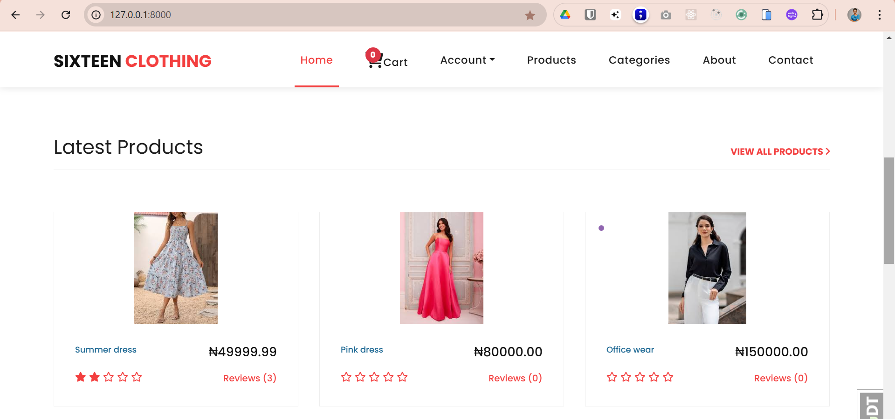
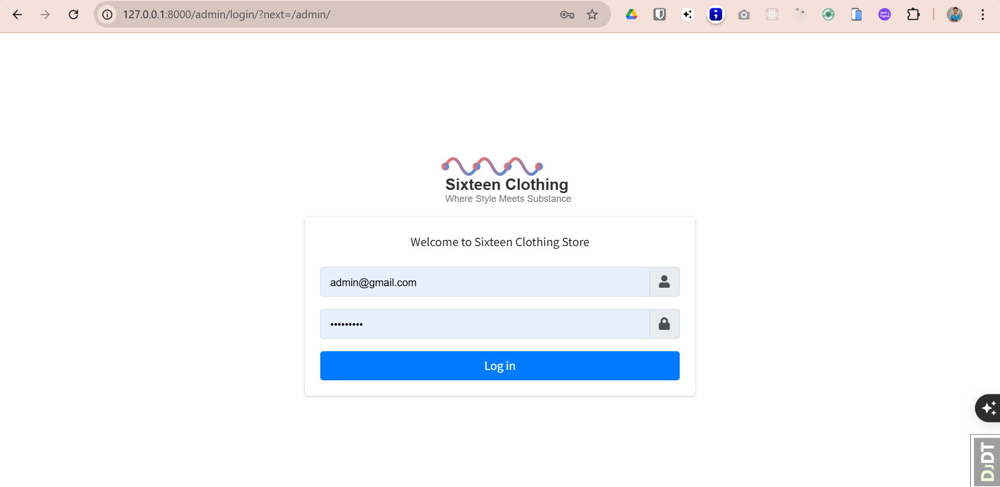
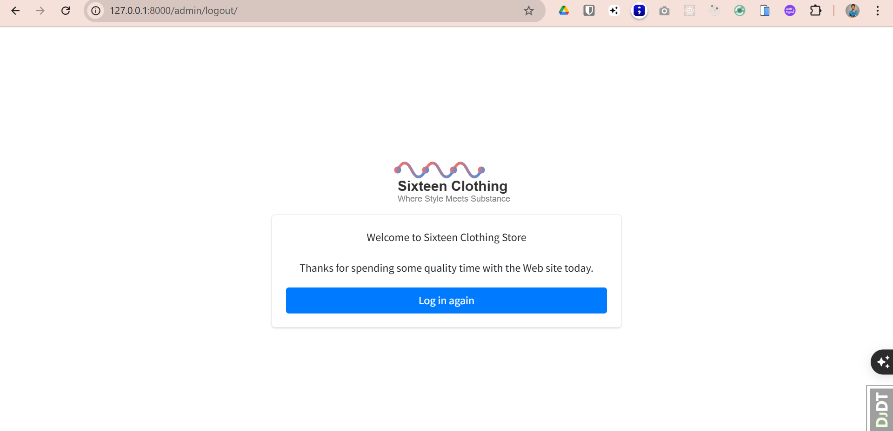
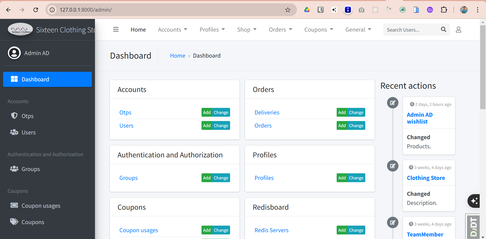
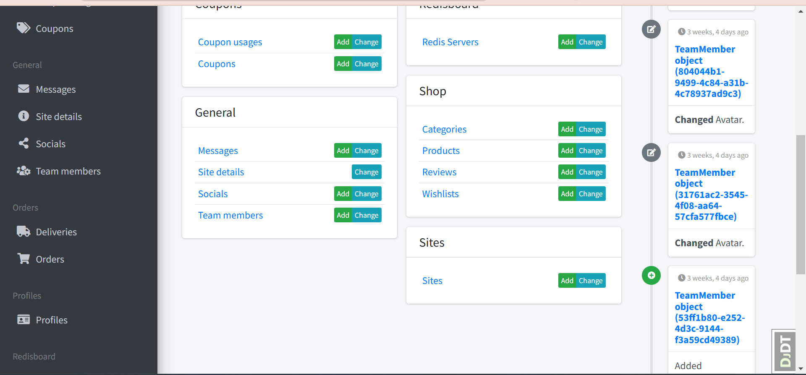
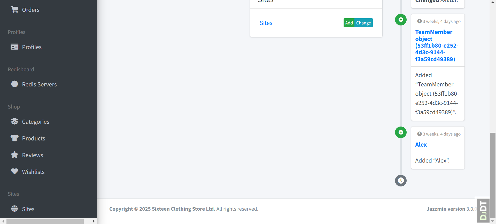

# Clothing store

# Features
* User Authentication and Registration
* Product Management
* Shopping Cart
* Wishlist
* Order Management
* Coupons
* User Profiles
* Reviews and Ratings
* Admin Dashboard

# Tech Stack
* Django
* Postgres
* Docker
* HTMX
* Celery & Redis for asynchronous tasks
* Meillisearch
  
# How to run locally
* Download this repo or run: 
```bash
    $ git clone repo
```

#### In the root directory:
- Create and activate a virtual environment
- Install all dependencies
```bash
    $ pip install -r requirements.txt
```
- Create an `.env` file and copy the contents from the `.env.example` to the file and set the respective values. A postgres database can be created with PG ADMIN or psql

- Run Locally
```bash
    $ python manage.py migrate
```
```bash
    $ python manage.py runserver
```
```bash
    $ python manage.py test apps.app_name.tests
```

**On windows**
```bash
    $ docker run -it --rm --name redis -p 6379:6379 redis
```
```bash
    $ celery -A clothing_store worker -l info --pool=solo
```
```bash
    $ celery -A clothing_store beat -l info
```
```bash
    $ celery -A clothing_store flower --basic-auth=admin:password
```

- Run With Docker
```bash
    $ docker-compose up  
```
```bash
    $ docker compose exec web python manage.py migrate
```
```bash
    $ docker compose exec web python manage.py createsuperuser
```
```bash
    $ docker-compose exec web python manage.py collectstatic
```

- Run with ngrok
 ```bash
    $   ngrok http 8000
```

## NOTE
* For product search check the meillisearch docs on how to download meillisearch with docker and run it locally.
* Read the article on how to build fast search with meillisearch to understand what to do for it to work properly.
* For webhook to work with paystack install ngrok with choco. Follow the installation guide in the resources section. Ensure choco is installed on your system.

## Resources 
* [Meilisearch Documentation](https://www.meilisearch.com/docs)
* [HTMX Documentation](https://v2-0v2-0.htmx.org/docs/)
* [Ngrok](https://download.ngrok.com/downloads/windows)
* [Integrating Paystack Payment Gateway Into Your Django Project - Part I](https://willingly.hashnode.dev/integrating-paystack-payment-gateway-with-django)
* [Integrating Paystack Payment Gateway Into Your Django Project - Part II](https://willingly.hashnode.dev/integrating-paystack-payment-gateway-with-django-ii)
* [Django HTMX Server-Side Datatables](https://www.advantch.com/blog/django-htmx-server-side-datatables/)
* [Build a fast search UI with Meilisearch, HTMX, and Django](https://www.advantch.com/blog/build-a-fast-search-ui-with-meilisearch-htmx-and-django/)
  
# Home Page
   

# Admin login
  

# Admin logout
  

# Admin dashboard
  
  
  
 

